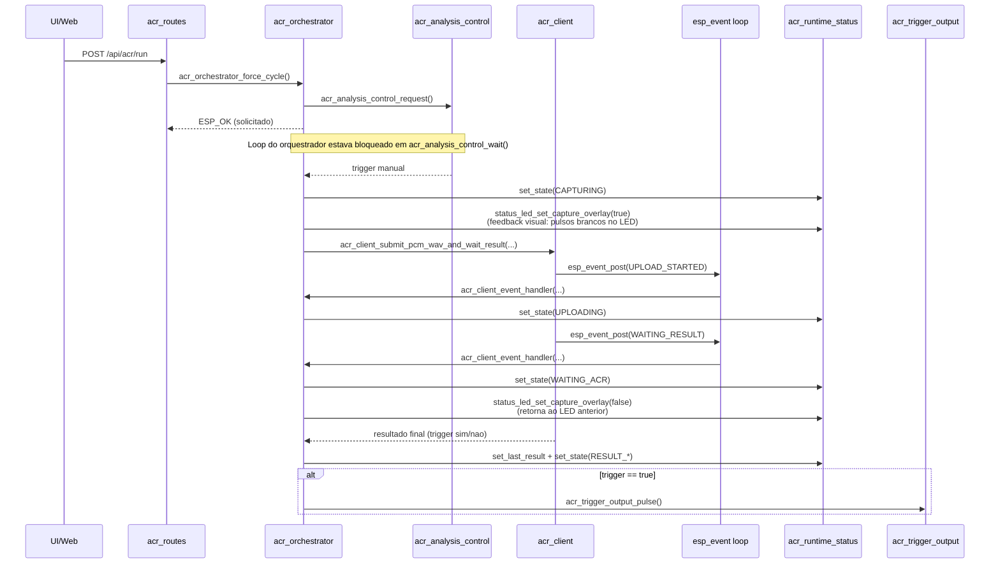

# Estrutura de main/app em alto nivel

## Objetivo

Este documento resume a arquitetura do codigo em main/app:

- funcao de cada arquivo;
- funcao das principais rotinas dentro de cada arquivo;
- como os modulos se integram entre si;
- interfaces usadas fora de main/app, sem detalhar os internals dessas outras pastas.

**Nota:** Este documento detalha a implementacao de aplicacao (ACRCloud). Para entender os padroes arquiteturais de conectividade que suportam este modulo, consulte [wifi_manager_architecture.md](wifi_manager_architecture.md).

## Visao geral de integracao

Fluxo principal do subsistema ACR:

1. O sistema inicia os modulos de controle, trigger e rotas HTTP.
2. O orquestrador entra em loop aguardando gatilho de analise.
3. Ao disparar, captura audio PCM em memoria.
4. Monta WAV em memoria e envia para ACRCloud via HTTP.
5. Faz polling do resultado da analise.
6. Aplica politica de trigger (IA vs humano).
7. Se aplicavel, gera pulso GPIO de saida.
8. Atualiza status de runtime para UI/monitoramento.

Ponto de entrada no app:

- main/main.c chama, nesta ordem:
  - acr_analysis_control_init();
  - acr_trigger_output_init();
  - acr_routes_register_with_portal();
  - acr_orchestrator_run();

## Mecanismo de comunicacao e disparo

O disparo entre funcoes/modulos e hibrido. Existem 4 mecanismos principais:

1. Chamada direta de funcao (sincrona)
2. Evento local via FreeRTOS EventGroup (sinalizacao de trigger)
3. Evento pub/sub via esp_event (mensageria de estado de upload/resultado)
4. Estado compartilhado protegido por spinlock (telemetria/status)

### 1) Chamada direta (controle de fluxo)

E o mecanismo dominante no caminho de execucao:

- acr_orchestrator chama diretamente captura, cliente ACR, parser (via cliente), trigger GPIO e atualizacao de status.
- handlers HTTP em acr_routes chamam diretamente modulos de controle/config/trigger.

Caracteristica:

- fluxo deterministico e simples de seguir;
- sem fila explicita entre esses modulos.

### 2) EventGroup (disparo de ciclo)

Existe um canal de sinalizacao tipo "mensagem curta" entre solicitantes de ciclo e o loop do orquestrador:

- acr_analysis_control_request seta bit de requisicao manual.
- acr_analysis_control_wait bloqueia em xEventGroupWaitBits aguardando:
  - requisicao manual;
  - mudanca de configuracao;
  - ou timeout para modo automatico.

Isso funciona como um "gatilho por mensagem de bit", sem payload.

### 3) esp_event (mensagens de progresso ACR)

Aqui existe, de fato, um barramento de mensagens pub/sub:

- acr_client publica eventos ACR_CLIENT_EVENT com esp_event_post.
- acr_orchestrator registra handler com esp_event_handler_register.
- o handler dispara transicoes via funcao central de estado no orquestrador.
- runtime_status e LED sao atualizados por essa funcao unica de transicao.

Eventos tipicos:

- upload iniciado;
- aguardando resultado;
- resultado IA;
- resultado humano;
- falha.

### 4) Estado compartilhado com lock (nao e mensageria)

acr_runtime_status nao envia mensagens. Ele funciona como um "quadro de estado" global:

- escritores atualizam campos com funcoes set_*;
- leitores fazem snapshot via get;
- acesso protegido por portENTER_CRITICAL/portEXIT_CRITICAL.

Ou seja: e sincronizacao por memoria compartilhada, nao por fila de mensagens.

## Sequencia de disparo (manual via API)

## Leitura rapida: "e mensagens ou nao?"

- Sim, parcialmente: ha mensageria em esp_event (pub/sub) e em EventGroup (bits de trigger).
- Nao, no restante do fluxo: a maior parte e chamada direta de funcao.
- Status/telemetria: modelo de memoria compartilhada com lock.

## Maquina de estados (oficial)

Para reduzir ambiguidade de autoria de estado, as transicoes foram centralizadas no orquestrador.

- arquivo: main/app/acr_orchestrator.c
- funcao central: orchestrator_transition_to(...)
- validacao: transition_allowed(...)

Transicoes permitidas:

- IDLE -> CAPTURING
- CAPTURING -> UPLOADING, WAITING_ACR, SILENCE_DISCARDED, ERROR
- UPLOADING -> WAITING_ACR, RESULT_HUMAN, RESULT_AI, ERROR
- WAITING_ACR -> RESULT_HUMAN, RESULT_AI, ERROR
- SILENCE_DISCARDED -> CAPTURING, IDLE
- RESULT_HUMAN -> CAPTURING, IDLE
- RESULT_AI -> CAPTURING, IDLE
- ERROR -> CAPTURING, IDLE
- RETRY_WAIT -> CAPTURING, IDLE

Comportamento para transicao invalida:

- e ignorada;
- gera log de aviso com origem e destino.

Beneficio pratico:

- previsibilidade do estado exposto para API/UI;
- menor risco de regressao quando adicionar novos eventos/etapas;
- caminho unico para mapear estado de runtime e estado de LED.

## Papel de cada arquivo em main/app

### acr_analysis_control.c / acr_analysis_control.h

Responsavel por controlar quando uma analise deve rodar.

- Mantem configuracao de controle (modo de trigger, intervalo automatico, duracao de captura, filtros de silencio/atividade etc).
- Usa Event Group para sinalizar pedido manual/config e timeout para modo automatico.
- Normaliza e valida parametros antes de salvar.
- Persiste configuracao em NVS.

Funcoes principais:

- acr_analysis_control_init: inicializa estado/event group e carrega config.
- acr_analysis_control_request: solicita ciclo manual.
- acr_analysis_control_wait: bloqueia aguardando evento ou timeout e retorna o tipo de gatilho.
- acr_analysis_control_set_last_cycle_ms: registra timestamp do ultimo ciclo.
- acr_analysis_control_get_config: retorna config atual.
- acr_analysis_control_save_config: valida/normaliza/salva config e sinaliza mudanca.

### acr_client.c / acr_client.h

Cliente HTTP para upload de audio e espera de resultado da ACRCloud.

- Monta multipart/form-data para envio de audio.
- Gera nome unico de upload (com prefixo configuravel).
- Faz polling do endpoint de resultado com retries/backoff.
- Converte resposta JSON em estrutura de resultado.
- Publica eventos ACR_CLIENT_EVENT para observabilidade.

Funcoes publicas:

- acr_client_submit_and_wait_result: envia arquivo no storage e aguarda resultado estruturado.
- acr_client_submit_pcm_wav_and_wait_result: envia PCM em memoria (convertido para WAV) e aguarda resultado.
- acr_client_submit_and_wait: caminho legado simplificado.

Funcoes internas relevantes:

- acr_upload_file / acr_upload_pcm_wav_memory: upload para API.
- acr_wait_for_result: polling da resposta final.
- fill_client_result / acr_trigger_policy_matches: aplica regra de trigger e consolida retorno.

### acr_config_store.c / acr_config_store.h

Camada de persistencia da configuracao ACR.

- Carrega/salva region, container_id, bearer_token e upload_prefix.
- Carrega/salva certificado raiz (NVS/arquivo com fallback embarcado).
- Sanitiza entradas textuais e valida PEM basica.
- Expoe versao publica da config para a API.

Funcoes principais:

- acr_config_store_load: carrega config completa para uso do cliente ACR.
- acr_config_store_get_public_info: retorna dados seguros para UI.
- acr_config_store_load_upload_prefix: recupera prefixo do nome de upload.
- acr_config_store_save_region/container_id/bearer_token/upload_prefix/root_cert: persistencia dos campos.

### acr_orchestrator.c / acr_orchestrator.h

Coordenador do ciclo completo de analise ACR.

- Executa loop principal de operacao.
- Aguarda trigger do modulo de controle.
- Verifica/conduz estado de Wi-Fi antes de enviar.
- Ativa overlay visual de captura no LED (pulsos brancos durante audio) antes de capturar.
- Captura audio, envia ao cliente ACR e processa resultado.
- Aciona trigger de saida quando politica indicar.
- Atualiza status de runtime e agenda retry quando necessario.

Funcoes principais:

- acr_orchestrator_run: loop infinito principal.
- acr_orchestrator_force_cycle: solicita ciclo forçado quando estado permite.

Funcoes internas relevantes:

- run_cycle: pipeline completo de uma execucao (incluindo ativar/desativar capture overlay).
- wait_until_wifi_ready / maybe_recover_wifi_after_retry: controle de conectividade.
- schedule_retry: agenda tentativa futura apos falha.
- acr_client_event_handler: traduz eventos do cliente para status/log.

### acr_parser.c / acr_parser.h

Parser de resposta JSON da ACRCloud.

- Extrai estado/predicao/probabilidade de estruturas de resposta.
- Procura resultado associado ao arquivo enviado.
- Padroniza resumo para log.

Funcoes principais:

- acr_parser_extract_matching_file_result: extrai resultado util da resposta JSON.
- acr_parser_log_result_summary: registra resumo da decisao para diagnostico.

### acr_routes.c / acr_routes.h

Rotas HTTP da aplicacao para configuracao e controle de ACR.

- Registra endpoints com o portal web.
- Implementa handlers REST de leitura/escrita de configuracoes.
- Exposicao de acao manual de analise.
- Exposicao de configuracao e teste da saida de trigger GPIO.

Rotas e handlers principais:

- GET /api/config: api_config_get_handler
- POST /api/acr: api_acr_post_handler
- GET /api/acr/status: api_acr_status_get_handler (status e telemetria puros do modulo ACR, separado de /api/status core)
- POST /api/acr/run: api_acr_run_post_handler
- GET /api/acr/control: api_acr_control_get_handler
- POST /api/acr/control: api_acr_control_post_handler
- GET /api/trigger-output: api_trigger_output_get_handler
- POST /api/trigger-output: api_trigger_output_post_handler
- POST /api/trigger-output/test: api_trigger_output_test_post_handler
- acr_routes_register_with_portal: registro de todas as rotas.

### acr_runtime_status.c / acr_runtime_status.h

Estado compartilhado de runtime do subsistema ACR.

- Guarda estado atual, mensagem, contadores e metricas de ciclo.
- Guarda metricas de captura (bytes, rms, pico, silencio).
- Guarda ultimo resultado ACR e dados de retry.
- Protege escrita/leitura com spinlock para acesso concorrente.

Funcoes principais:

- clear/get: limpeza e snapshot do status.
- set_state/set_message/set_retry/set_timings/set_audio_capture: atualizacoes por etapa.
- increment_acr_submitted/silence_discarded/acr_error: contadores.
- set_last_result: registra ultima decisao.
- get_state/state_name: consulta de estado para UI/log.

### acr_trigger_output.c / acr_trigger_output.h

Controle da saida fisica de trigger via GPIO.

- Carrega/salva configuracao (GPIO, nivel ativo, duracao de pulso).
- Configura pino de saida e mantem estado inativo.
- Gera pulso de trigger quando requisitado.
- Mantem status protegido por spinlock.

Funcoes principais:

- acr_trigger_output_init: inicializa e aplica config persistida.
- acr_trigger_output_get_status: retorna estado/config efetivos.
- acr_trigger_output_save_config: valida e persiste nova config.
- acr_trigger_output_pulse: aplica pulso de trigger.

### storage.c / storage.h

Abstracao simples de storage local em FATFS (SPI flash WL).

- Monta particao de storage.
- Verifica existencia e tamanho de arquivo.
- Loga metadados de arquivo para diagnostico.

Funcoes principais:

- storage_mount
- storage_file_exists
- storage_file_size
- storage_log_file_info

### firmware_version.h

Define constante de versao de firmware usada pelo sistema.

## Como os modulos de main/app se encaixam

Relacao de dependencia no ciclo principal:

1. acr_orchestrator usa acr_analysis_control para decidir quando rodar.
2. acr_orchestrator usa acr_config_store para carregar credenciais e cert.
3. acr_orchestrator usa audio_capture (externo) para obter PCM.
4. acr_orchestrator usa acr_client para upload/polling e resultado.
5. acr_client usa acr_parser para extrair decisao da resposta JSON.
6. acr_orchestrator usa acr_trigger_output para pulso GPIO quando trigger=true.
7. acr_orchestrator e acr_client atualizam acr_runtime_status continuamente.
8. acr_routes expoe operacoes desses modulos para o portal web.

## Interfaces externas usadas por main/app (sem aprofundar internals)

### main/audio

- audio_capture_record_pcm_to_buffer(...)
  - Interface usada para capturar audio PCM para analise.

- wav_writer_build_header(...)
  - Interface usada para montar cabecalho WAV ao enviar audio em memoria.

### main/connectivity

- wifi_manager_wait_until_ready(...)
- wifi_manager_get_status(...)
- wifi_manager_reconnect_sta(...)
- wifi_manager_set_high_throughput_mode(...)
  - Interfaces usadas para garantir conectividade antes/durante o ciclo ACR.

- status_led_set_state(...), status_led_get_state(...)
  - Interface de feedback visual de estados relevantes do fluxo ACR.

### main/portal

- web_portal_register_app_routes(...)
  - Interface de registro das rotas REST definidas em acr_routes.

### utilitarios HTTP/JSON

- http_helpers_recv_body(...), http_helpers_send_json(...)
  - Interfaces para leitura de body e resposta JSON nos handlers HTTP.

- cJSON API
  - Interface para parse e construcao de JSON em rotas e parser de resultados.

### ESP-IDF e FreeRTOS

- NVS (nvs_open/get/set/commit/close): persistencia de configuracoes.
- esp_http_client_*: upload multipart e polling HTTPS.
- esp_event_*: emissao/consumo de eventos do cliente ACR.
- FreeRTOS EventGroup/Task/Delay/spinlock: sincronizacao e temporizacao.
- GPIO driver: configuracao e pulso de saida.
- VFS FAT + wear leveling: montagem e acesso ao storage local.

## Estados compartilhados e sincronizacao

- acr_analysis_control: EventGroup + config ativa + timestamp do ultimo ciclo.
- acr_runtime_status: struct global protegida por spinlock.
- acr_trigger_output: status/config de GPIO protegidos por spinlock.
- acr_client: buffer de resposta HTTP global (uso esperado em fluxo serial).

## Resumo

main/app implementa um subsistema ACR coeso com quatro blocos centrais:

- controle de ciclo (acr_analysis_control + acr_orchestrator);
- integracao cloud (acr_client + acr_parser + acr_config_store);
- interface operacional (acr_routes + acr_runtime_status);
- atuacao fisica e base local (acr_trigger_output + storage).

A separacao favorece manutencao: regras de ciclo, rede/cloud, API HTTP e GPIO ficam desacopladas por interfaces explicitas.
